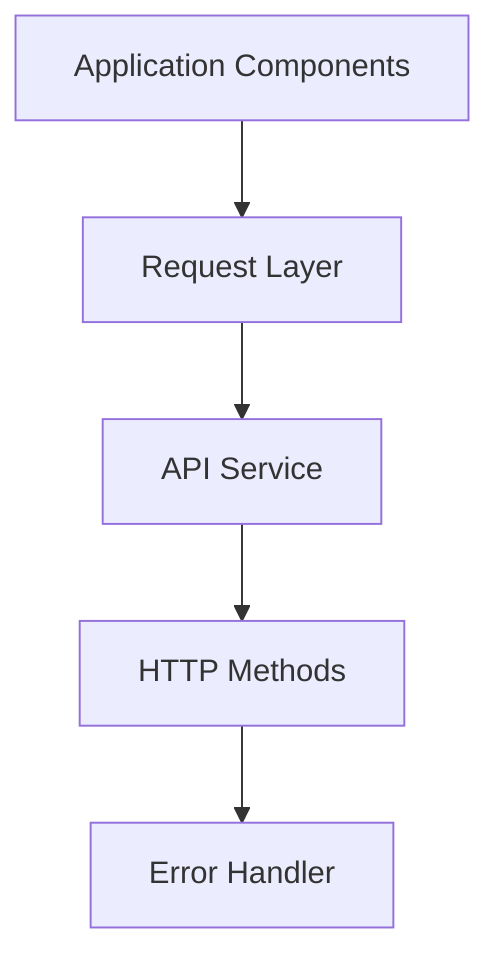
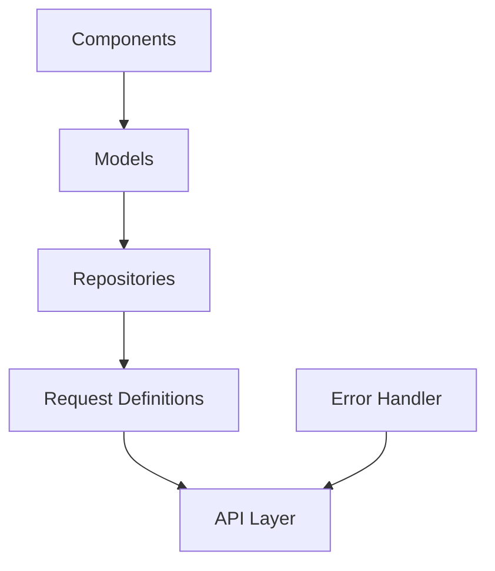

# API Layer Architecture

## Overview

The API layer handles communication between the frontend application and backend services with a focus on reliability, resilience, and standardized error handling. This architecture is designed to provide a robust foundation for all data fetching operations in the application.

## Current Implementation

### Files in the API Folder

| File | Purpose |
|------|---------|
| `api.ts` | Main entry point for API requests |
| `error-handler.ts` | Standardizes error handling |
| `methods.ts` | HTTP method implementations |
| `request-processor.ts` | Orchestrates request pipeline |
| `circuit-breaker.ts` | Prevents cascading failures |
| `cache-manager.ts` | Manages cached responses |
| `cache.ts` | Core caching implementation |
| `request-deduplication.ts` | Prevents duplicate requests |
| `network-listener.ts` | Handles online/offline status |
| `auth-token-manager.ts` | Manages authentication |
| `README.md` | This documentation file |

## Detailed Component Descriptions

### 📄 `api.ts`

**Purpose**: The main entry point and facade for all API operations. Acts as the central coordination point that initializes and configures all API-related services.

**Key Features**:
- Provides a unified interface for all HTTP methods
- Configures global settings like base URL, timeouts, and headers
- Creates and exports a singleton API service instance

**Implementation Rationale**: 
Implemented as a singleton using the facade pattern to hide the complexity of the underlying system. This approach gives components a simple, consistent interface while the API layer handles all the intricate details of request processing, error handling, and resilience.

**Importance**:
As the main entry point, it's critical for maintaining a cohesive API strategy across the application. It ensures consistent behavior for all API calls regardless of which component or module initiates them.

### 📄 `error-handler.ts`

**Purpose**: Standardizes error handling across all API operations to provide consistent, user-friendly error messages.

**Key Features**:
- `handleError()`: Primary method for processing API errors
- `standardizeError()`: Converts various error types into a consistent format
- `isServerError()`: Helper to identify server-side errors
- Error normalization from different sources (Axios, native fetch, etc.)

**Implementation Rationale**: 
Implemented as a separate specialized service to centralize error handling logic. This prevents code duplication and ensures consistent error handling across the application. The standardized error format makes it easier for UI components to display appropriate error messages.

**Importance**:
Proper error handling significantly improves the user experience by providing clear feedback when operations fail. The standardized approach also makes debugging easier by ensuring errors are consistently formatted and logged.

### 📄 `methods.ts`

**Purpose**: Provides specialized HTTP method implementations with added functionality beyond basic requests.

**Key Features**:
- Type-safe method wrappers for GET, POST, PUT, DELETE, PATCH
- Enhanced methods like `getSWR` (stale-while-revalidate pattern)
- Automatic error handling through the error handler

**Implementation Rationale**:
Separating HTTP methods into their own file allows for specialized behavior per method type. This separation of concerns makes the code more maintainable and allows for method-specific optimizations.

**Importance**:
These method implementations ensure type safety and consistent behavior across all API calls, reducing bugs related to incorrect API usage or inadequate error handling.

### 📄 `request-processor.ts`

**Purpose**: Orchestrates the request lifecycle, applying various enhancements and protections.

**Key Features**:
- Coordinates multiple request enhancers (circuit breaker, cache, etc.)
- Provides a pipeline architecture for request processing
- Manages request context throughout the lifecycle

**Implementation Rationale**:
Using a pipeline pattern allows for modular request processing, where each step can be individually tested and maintained. This approach makes it easy to add new capabilities to the request flow without modifying existing code.

**Importance**:
By centralizing request flow management, it ensures all requests benefit from the same enhancements and protections, providing a consistent and reliable API experience.

### 📄 `circuit-breaker.ts`

**Purpose**: Implements the circuit breaker pattern to prevent cascading failures when services are degraded.

**Key Features**:
- Three circuit states: CLOSED (normal), OPEN (failing), HALF_OPEN (testing)
- Automatic detection of service failures
- Self-healing mechanism that tests recovery
- Configurable failure thresholds and recovery timeouts

**Implementation Rationale**:
Based on Michael Nygard's "Release It!" circuit breaker pattern, this component isolates the application from failing dependencies. By "failing fast" when a service is known to be degraded, it prevents resource exhaustion and gives the service time to recover.

**Importance**:
Critical for maintaining application responsiveness even when backend services are experiencing issues. Prevents the "death spiral" where continued requests to failing services make recovery even harder.

### 📄 `cache-manager.ts`

**Purpose**: Manages the caching strategy for API responses to improve performance and reduce backend load.

**Key Features**:
- Time-based cache expiration
- Cache key generation based on request parameters
- Selective cache bypassing for critical or real-time data
- Cache invalidation mechanism
- Cache hit/miss metrics

**Implementation Rationale**:
Separating cache management from cache implementation allows for different caching strategies to be used without changing the underlying storage mechanism. This separation follows the strategy pattern, making the caching behavior configurable.

**Importance**:
Effective caching dramatically improves application performance and reduces server load, leading to a better user experience with faster response times and increased reliability.

### 📄 `cache.ts`

**Purpose**: Implements the core caching storage and retrieval mechanisms.

**Key Features**:
- Abstract cache provider interface
- Concrete implementations for various storage types (memory, localStorage, etc.)
- Serialization/deserialization of cache data
- TTL (Time To Live) enforcement

**Implementation Rationale**:
By separating cache implementation from cache strategy, the application can switch between different cache storage providers (memory for SSR, localStorage for browser, etc.) without changing the caching behavior.

**Importance**:
Provides the actual storage mechanism that makes caching possible, with the flexibility to adapt to different environments and storage requirements.

### 📄 `request-deduplication.ts`

**Purpose**: Prevents duplicate API requests for the same resource within a short time window.

**Key Features**:
- Request fingerprinting based on method, URL, and parameters
- In-flight request tracking
- Automatic cleanup of completed requests
- Returns existing promises for duplicate requests

**Implementation Rationale**:
Uses a registry pattern to track in-flight requests by their unique signature. This prevents redundant network traffic and backend load, especially important in scenarios where multiple components might request the same data simultaneously (e.g., during route changes).

**Importance**:
Improves application efficiency by eliminating unnecessary duplicate requests, which is particularly valuable on mobile networks or when backend services have rate limits.

### 📄 `network-listener.ts`

**Purpose**: Monitors network connectivity and manages request behavior during offline periods.

**Key Features**:
- Online/offline detection
- Request queuing during offline periods
- Automatic retry when connection is restored
- Network state notifications

**Implementation Rationale**:
Implemented as an event-driven service that responds to browser network events and coordinates with the request processor. This allows the application to gracefully handle connectivity issues instead of simply failing requests.

**Importance**:
Enhances the user experience in unstable network environments by providing offline capabilities and seamless recovery when connectivity is restored.

### 📄 `auth-token-manager.ts`

**Purpose**: Manages authentication tokens and ensures they're included with appropriate requests.

**Key Features**:
- Secure token storage
- Automatic token inclusion in request headers
- Token refresh mechanisms
- Session expiration handling

**Implementation Rationale**:
Authentication is implemented as a separate service to keep it decoupled from the core request functionality. This separation of concerns makes it easier to maintain and allows for different authentication strategies without changing the rest of the API layer.

**Importance**:
Proper authentication management is crucial for security and user session handling. This component ensures all API requests that require authentication are properly authorized.

## Current Architecture

The API layer follows a layered architecture:



## Overall System Architecture



### Files Supporting the Architecture

| File | Location | Purpose |
|------|----------|---------|
| `requests.ts` | `lib/` | Centralized API endpoint definitions |
| `portfolio.repository.ts` | `lib/repositories/` | Portfolio data operations |
| `portfolio.model.ts` | `lib/models/` | Portfolio business logic |
| `portfolio.store.ts` | `lib/stores/` | State management |

## Design Patterns Used

1. **Singleton Pattern**: Each service is exported as a singleton instance, ensuring consistent state and behavior across the application.

2. **Facade Pattern**: API service provides a simple interface that hides the complexity of the underlying components, making it easier for client code to use.

3. **Repository Pattern**: Separates data access logic from business logic, allowing each layer to focus on its specific responsibilities.

4. **Circuit Breaker Pattern**: Prevents system overload during failure scenarios by "breaking the circuit" when a dependent service is failing.

5. **Strategy Pattern**: Different strategies (like caching, authentication) can be swapped without affecting the core API functionality.

6. **Pipeline Pattern**: Request processing is organized as a series of steps, each handling a specific aspect of the request lifecycle.

## Error Handling

Error handling follows a consistent pattern:
1. API errors are caught and standardized by the error handler
2. Standardized errors include: status code, message, original data
3. Components can display these standardized errors directly
4. Error logging occurs at appropriate levels

### Common Error Types and Resolution

| Error Type | Possible Cause | Resolution |
|------------|--------------|------------|
| 401 Unauthorized | Invalid or expired token | Check authentication flow |
| 403 Forbidden | Lack of permissions | Verify user roles and access rights |
| 404 Not Found | Invalid API endpoint | Check URL and API version |
| 500 Server Error | Backend issue | Check server logs |
| Network Error | Connectivity issues | Check internet connection |

## Integration with Models & Repositories

The API layer is designed to work with our model and repository architecture:

1. **Components** use Models for business logic and data presentation
2. **Models** use Repositories to fetch and persist data
3. **Repositories** use centralized API request definitions (`requests.ts`)
4. **API Layer** handles the actual communication with the backend

## Logging

API operations are logged using the structured logging system:

```typescript
import { getLogger } from '@/lib/logger';
const logger = getLogger("ApiCategory");

// Usage
logger.info("API operation completed");
logger.error("API error occurred", error);
```

## Best Practices

1. **Use repositories**: Don't call API methods directly from components
2. **Handle errors**: Always handle potential errors from API calls
3. **Use standardized errors**: Leverage the error handler to standardize errors
4. **Consider loading states**: API calls are asynchronous, UI should reflect this
5. **Leverage caching**: Use appropriate caching strategies for different types of data
6. **Mind network conditions**: Consider offline usage scenarios when appropriate

## Implementation Status

The API layer architecture is being implemented incrementally. Currently, the core API service, HTTP methods, and error handling are fully implemented. Other components like circuit breaker, caching, and request deduplication are being developed based on application needs.
